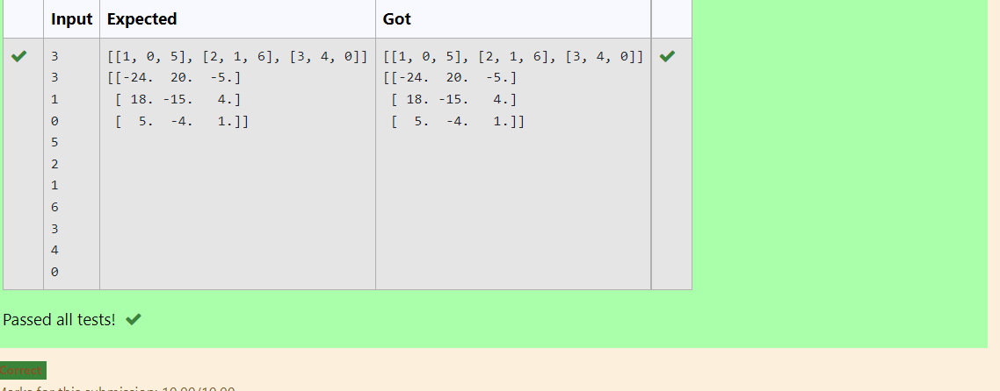

# Inverse-of-matrix

## AIM:

## ALGORITHM:
### Step 1:
Import numpoy as np
### Step 2:
Declare a variable |1 and |2 as an empty list.
### Step 3:
Get the input of the variable n and m.
### Step 4:
Loop a variable i in the range of n and nest loop a variable j in range m.
### Step 5:
Get the value of num variable.
### Step 6:
During the loop append the num values to |1 and |1 values to list |2
### Step 7:
Declare a variable value 1 to |2 by covesting to an array 
### Step 8:
Declare a variable inverse, using numpy module's linalag and inv functions find the inverse of |2
### Step 9:
Pringt the value of the inverse

## PROGRAM:
import numpy as np

l1,l2=[],[]

n1,n2=int(input()),int(input())

for i in range (n1):

    for j in range (n2):
       values=int(input())
       l1.append(values)
    l2.append(l1)
    l1=[]
print(l2)

matrix=np.array(l2)

inverse=np.linalg.inv(matrix)

print(inverse)

## OUTPUT:

## RESULT:
Thus the program is completed succesfully
